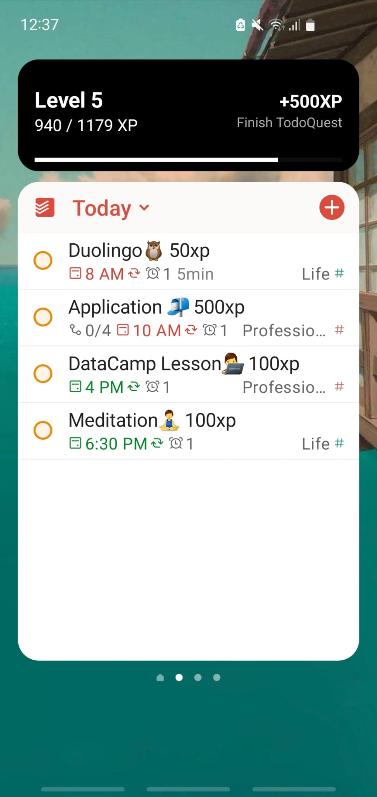
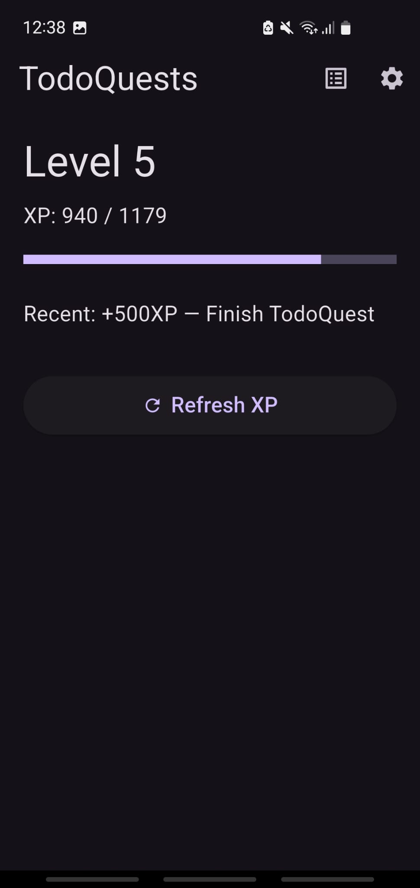
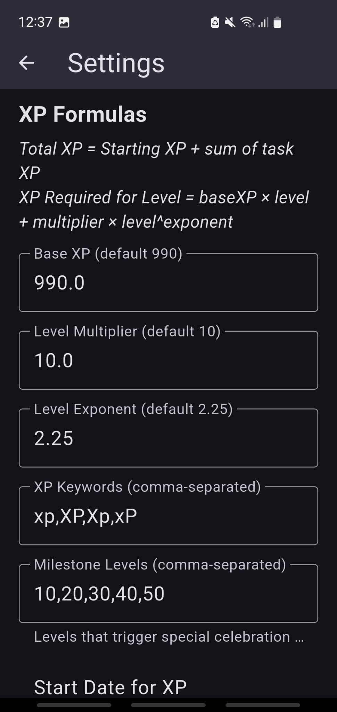
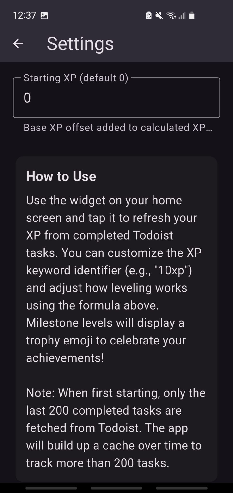

# TodoQuests

**Turn your Todoist tasks into XP and level up your life!**

TodoQuests is a Flutter-based gamification app that transforms your completed Todoist tasks into experience points (XP). Watch yourself level up as you complete tasks, with a beautiful Android home widget that updates in real-time showing your progress.

## 📦 Download

[](https://github.com/PascalJPan/TodoQuests/releases/download/v1.0.1/TodoQuests_v1.0.1.apk)

---

## Features

- **Todoist Integration**: Automatically syncs with Todoist to fetch completed tasks
- **XP System**: Assign XP values to tasks using keywords (e.g., "Complete workout +50xp")
- **Level Progression**: Customizable XP formula with exponential growth
- **Home Widget**: Real-time Android widget showing level, XP progress, and recent tasks
- **Background Updates**: Widget clicks refresh XP without opening the app
- **Milestone Celebrations**: Special visual effects for milestone levels
- **Diagnostic Logging**: Built-in debug logs for troubleshooting widget updates

---

## Screenshots






---

## Configuration

### 1. Get Your Todoist API Key

1. Visit [Todoist Settings → Integrations → Developer](https://todoist.com/app/settings/integrations/developer)
2. Copy your API token

### 2. Configure the App

1. Open TodoQuests
2. Tap the **Settings icon** (⚙️)
3. Enter your **Todoist API key**
4. Configure XP formula parameters (optional):
   - **Base XP**: Starting XP requirement per level (default: 990)
   - **Level Multiplier**: XP growth multiplier (default: 10)
   - **Level Exponent**: XP growth exponent (default: 2.25)
5. Set **XP Keywords** (default: `xp,XP,Xp,xP`)
6. Configure **Milestone Levels** (default: `10,20,30,40,50`)
7. Set **Start Date** to filter which tasks count toward XP
8. Tap **Save**

### 3. Add the Widget

1. Long-press on your Android home screen
2. Tap **Widgets**
3. Find and add **TodoQuests Widget**
4. The widget will display your current level and XP

---

## How to Use

### Marking Tasks with XP

Add XP values to your Todoist task names using keywords:

```
Complete Study 100xp
Laundry 250 XP
Penalty task -10xp 
```

**Supported formats**:
- `+100xp` or `+100 xp`
- `50XP` or `50 XP`
- `-25xp` (for penalties)

### Widget Interaction

- **Tap the widget** to refresh XP in the background
- Updates happen without opening the app
- Check **Logs → Debug Logs** to see widget click events

### Viewing Progress

- **Main Screen**: Shows current level, XP progress bar, and most recent XP gain
- **Pull to refresh**: Manually sync with Todoist
- **Logs → XP Activity**: View last 10 XP-earning tasks
- **Logs → Debug Logs**: Diagnostic events for troubleshooting

---

## XP Formula

The XP required for each level is calculated using:

```
XP_for_level = baseXP × level + multiplier × level^exponent
```

**Default values**:
- baseXP = 990
- multiplier = 10
- exponent = 2.25

**Example progression**:
- Level 1 → 2: 1,000 XP
- Level 2 → 3: 1,020 XP
- Level 5 → 6: 1,179 XP
- Level 10 → 11: 2,480 XP

---

## Troubleshooting

### Widget Not Updating

If widget clicks aren't updating your XP:

1. **Open the app at least once** after installing (registers background callback)
2. **Check network settings**:
   - Settings → Apps → TodoQuests → Battery → Disable "Background restriction"
   - Settings → Apps → TodoQuests → Mobile data → Enable "Allow background data usage"
3. **View Debug Logs**:
   - Open app → Logs → Debug Logs tab
   - Click widget and check for errors
4. **Common errors**:
   - `NO_API_KEY`: Add API key in Settings
   - `DNS_FAILURE`: Network blocking background requests
   - `XP_REFRESH_COOLDOWN`: Wait 500ms between clicks

### Real-Time Debugging

For advanced troubleshooting, use ADB logcat:

```bash
# Connect device
adb devices

# Watch logs in real-time
adb logcat | grep -E "LifeQuest|🔍|🔄|✅|❌"
```

See `WIDGET_DEBUG_GUIDE.md` for comprehensive debugging instructions.

---

## Architecture

### Core Components

**XP Service** (`lib/xp_service.dart`)
- Manages XP calculations and Todoist API integration
- Implements debouncing (500ms cooldown)
- Retry logic with exponential backoff
- Handles up to 200 completed tasks

**Widget Service** (`lib/lifequest_widget.dart`)
- Updates home screen widget
- Syncs XP data using `home_widget` package
- Supports background refresh via WorkManager

**Milestone Helper** (`lib/milestone_helper.dart`)
- Determines milestone levels from settings
- Provides color schemes for celebrations

**Debug Logger** (`lib/debug_logger.dart`)
- Persistent event logging to SharedPreferences
- Tracks widget clicks, API calls, and errors
- Keeps last 50 diagnostic events

### Android Widget

**LifeQuestWidgetProvider** (`android/app/src/main/kotlin/.../LifeQuestWidgetProvider.kt`)
- Displays level, XP progress, and recent tasks
- Handles widget click events
- Updates every 30 minutes + on-demand

**Background Refresh Flow**:
1. User taps widget
2. Android broadcasts `lifequest://refresh` intent
3. `HomeWidgetBackgroundReceiver` catches intent
4. Flutter `backgroundCallback()` executes in background
5. `LifeQuestService.refreshXP()` fetches from Todoist
6. Widget redraws with new data (app never opens)

---

## Development

### Project Structure

```
life_quests/                  # Flutter app
├── lib/
│   ├── main.dart            # Entry point + background callback
│   ├── xp_service.dart      # XP calculations + Todoist API
│   ├── lifequest_widget.dart # Widget data sync
│   ├── settings_page.dart   # Configuration UI
│   ├── logs_page.dart       # XP Activity + Debug Logs
│   ├── milestone_helper.dart # Milestone logic
│   └── debug_logger.dart    # Diagnostic logging
└── android/
│ └── app/src/main/kotlin/...
│     └── LifeQuestWidgetProvider.kt  # Android widget
```

### Building

**Debug build**:
```bash
flutter run
```

**Release build**:
```bash
flutter build apk --release
```

**Install on device**:
```bash
flutter install --release
```

### Running Tests

```bash
flutter test
```

### Code Analysis

```bash
flutter analyze
```

---

## Dependencies

**Core**:
- `flutter` (SDK ^3.9.2)
- `http` (^1.2.2) - Todoist API requests
- `shared_preferences` (^2.3.2) - Local data persistence
- `home_widget` (^0.8.1) - Cross-platform widget support

**Notifications** (future use):
- `flutter_local_notifications` (^17.2.2)

**Development**:
- `flutter_lints` (^5.0.0) - Code analysis rules
---

## Platform Support

**Primary Platform**: Android
- Full widget support with true background refresh
- Uses WorkManager for reliable background execution
- Tested on Android 10+

**Other Platforms**: iOS/macOS/Linux/Windows/Web exist in project structure but are not actively developed.

---

## Credits

**Built with**:
- [Flutter](https://flutter.dev/) - UI framework
- [Todoist API](https://developer.todoist.com/) - Task management
- [home_widget](https://pub.dev/packages/home_widget) - Widget integration

---

## Changelog

### v1.0.0 (2025-11-13)

**Initial Release**:
- Todoist integration with XP parsing
- Customizable XP formula
- Android home widget with background refresh
- Milestone celebrations
- Diagnostic logging system
- Debug logs for troubleshooting widget updates

**Fixes**:
- Widget background network access (added `ACCESS_NETWORK_STATE` permission)
- Milestone trophy emoji consistency between app and widget
- API timeout reduced from 30s to 10s for faster failure detection
- DNS failures now fail immediately instead of retrying

---

## Support

For issues and feature requests, please use the GitHub Issues page.

**Debug Resources**:
- `WIDGET_DEBUG_GUIDE.md` - Comprehensive widget troubleshooting
- `CLAUDE.md` - Project instructions for AI assistants
- Logs → Debug Logs tab in app - Real-time diagnostic events
